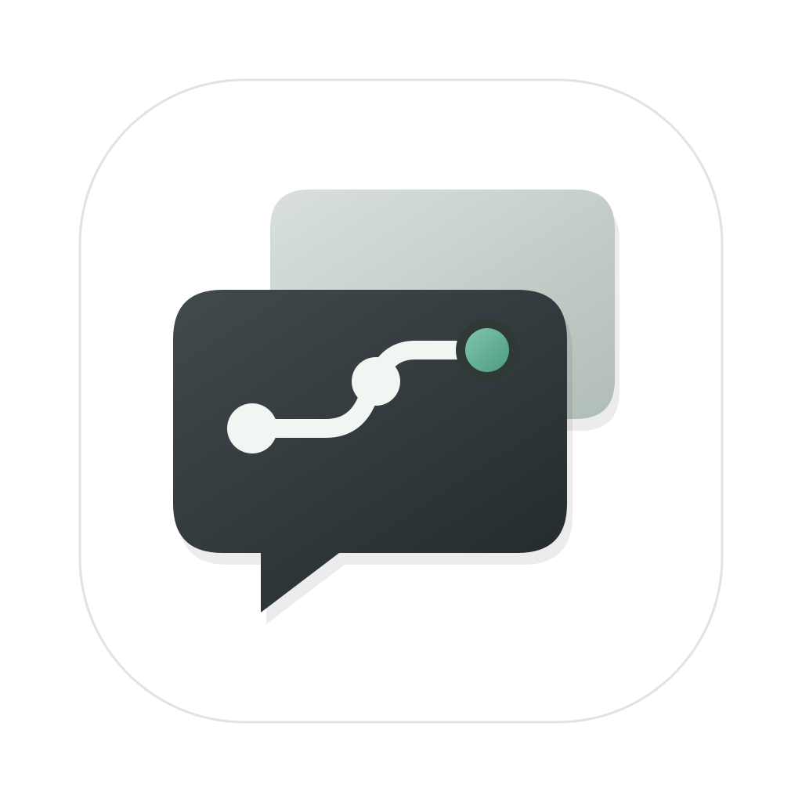
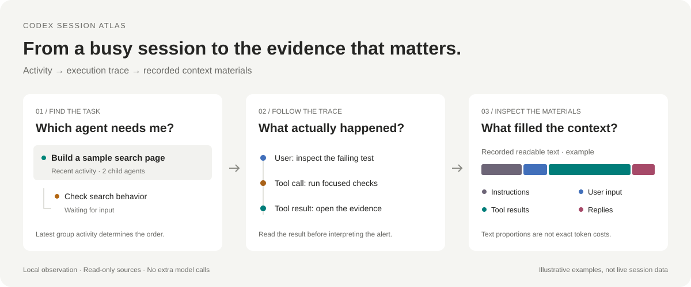

<div align="center">
  
  <h1>Codex Session Atlas</h1>
  <p><strong>See what your Codex agents are doing — and what is filling their context.</strong></p>
  <p>A native macOS session monitor for execution traces, context composition, token usage, and subagent activity.</p>
  <p><a href="https://github.com/LAwLi3tCoding/codex-session-atlas/releases/latest">Download for Mac</a> · <a href="docs/installation.md">Install guide</a> · <a href="docs/usage.md">User guide</a> · <a href="README.zh-CN.md">简体中文</a></p>
  <p>
    <a href="https://github.com/LAwLi3tCoding/codex-session-atlas/actions/workflows/ci.yml"></a>
    <a href="https://github.com/LAwLi3tCoding/codex-session-atlas/releases/latest"></a>
    <a href="LICENSE"></a>
    
  </p>
</div>

Running several Codex tasks makes it hard to tell which one needs you, why a tool keeps failing, or why context usage jumped. Session Atlas puts the local session list, execution history, and recorded context materials in one window, with links back to the evidence and the original task.

**Local data. Read-only observation. No API key or additional model calls.** The current application UI is in Simplified Chinese; this README and the installation and user guides are available in English and Chinese.



## What you can investigate

| Your question | Where to look | What to do with the evidence |
| --- | --- | --- |
| Which task needs my input? | Recent activity, waiting states, and attention items | Open the task in Codex and respond |
| Why did this run slow down or fail? | Failed tool calls, recorded duration, repeated calls, and output | Fix the failing command or narrow the next investigation |
| What grew between two context samples? | Context checkpoints and the materials recorded between them | Reduce large tool returns or repeated reads |
| Are project instructions or skills adding too much text? | Visible instruction and skill-description categories, plus source details | Review the actual materials before changing `AGENTS.md` or skill prompts |
| What is happening in the child agents? | Parent/child session tree and collaboration view | Inspect each child's status and context independently |

## What is included

- **Session browser:** local catalog, project/model search, archive and system-task filters, parent/child grouping. Default order is latest activity across each visible group; attention-first ordering is optional.
- **Execution trace:** recorded input, replies, tool calls, file changes, lifecycle events, compaction, and visible reasoning summaries. Filter loaded records; inspect readable content and source locations.
- **Context explorer:** compaction phases, usage samples, recorded text composition, retained/new materials, and adjacent-sample comparisons.
- **Attention items:** failures, waiting for input, repeated operations, large outputs, and high context usage, with evidence and adjustable thresholds.
- **Native desktop app:** SwiftUI, local incremental collection, paged history, optional macOS notifications. Close the window to keep observing; quit the app to stop.

## Install in a few minutes

Requires **macOS 13+**, an Apple Silicon or Intel Mac, and locally stored Codex sessions.

**Download:** get the `macos-universal.zip` from [Releases](https://github.com/LAwLi3tCoding/codex-session-atlas/releases/latest), unzip it, and move **Codex Session Atlas.app** to Applications. You do not need Xcode, Swift, or Homebrew.

**Terminal:** download the installer, optionally inspect it, then run it:

```bash
curl -fsSL https://raw.githubusercontent.com/LAwLi3tCoding/codex-session-atlas/main/Scripts/install.sh -o /tmp/codex-session-atlas-install.sh
bash /tmp/codex-session-atlas-install.sh
```

The script downloads the latest universal release, checks SHA-256 and the app signature, and installs into `~/Applications` without `sudo`. Updates keep one previous app as a backup. It does not modify Codex data or disable macOS security checks.

Community builds are **ad-hoc signed, not Apple-notarized**. If macOS blocks first launch, follow the [installation guide](docs/installation.md#first-launch-and-gatekeeper). A checksum confirms file integrity; it is not Apple developer verification.

## First useful check

1. Launch Session Atlas. It reads the local Codex data directory, normally `~/.codex`.
2. Select a task. **Overview / 概览** shows recent activity, context usage, and attention items.
3. Open **Trace / 轨迹** to inspect a failed or large tool result.
4. Open **Context / 上下文**, choose a phase and sample, then inspect the largest recorded materials or what appeared between adjacent samples.
5. Use **Open in Codex / 在 Codex 打开** to act on the result.

See the [user guide](docs/usage.md) for a concrete analysis workflow, category definitions, sorting rules, and settings.

## What the numbers mean

| Metric | Meaning | Important boundary |
| --- | --- | --- |
| Context usage | Latest recorded context tokens divided by the recorded capacity | A persisted sample, not a live view of every model request |
| Recorded text composition | Readable character counts grouped by material category | **Not exact token attribution**; excludes unavailable content |
| Token usage | Observed request/turn/session usage, where recorded | Not current context occupancy or a billing statement |
| Recently active | Unfinished turn with execution/start evidence within five minutes | A long silent command can become “status unconfirmed”; this does not prove it stopped |

Session Atlas cannot expose hidden reasoning, decrypt opaque summaries, reconstruct omitted system prompts/tool definitions, or inspect remote sessions that are not stored locally. “Turn ended” does not mean the user's whole goal is complete. The explorer labels incomplete history and unknown values instead of filling gaps. [Data model and accuracy](docs/data-and-privacy.md)

## Privacy and compatibility

The monitor reads local SQLite indexes and JSONL logs. It keeps its own local checkpoints, bounded summaries, and usage cache; it does not upload session content, include telemetry, or edit source sessions. An optional local `codex app-server` title lookup uses `thread/list` only. No model requests or task-resume commands are sent by the monitor. Codex's own process behavior remains outside the monitor's control.

These local formats are implementation details of Codex and may change. Missing fields and unreadable sources are reported; compatibility with every Codex version is not guaranteed. Cloud synchronization, cross-machine monitoring, automatic repair, and cost billing are not included.

## Build and contribute

Requires **Swift 6.1+** and macOS developer tools. No third-party package dependencies.

```bash
git clone https://github.com/LAwLi3tCoding/codex-session-atlas.git
cd codex-session-atlas
swift run FixtureChecks
swift run ObservationChecks
Scripts/make-app.sh --universal
open "build/Codex Session Atlas.app"
```

Useful contributions include sanitized format-compatibility fixtures, clearer context explanations, performance regressions, and an English UI. Please read [CONTRIBUTING.md](CONTRIBUTING.md) before opening an issue or pull request. Never attach real session logs, credentials, or private project content.

## Documentation

- [Installation and troubleshooting](docs/installation.md) · [安装手册](docs/installation.zh-CN.md)
- [User guide](docs/usage.md) · [使用手册](docs/usage.zh-CN.md)
- [Data and privacy](docs/data-and-privacy.md) · [数据口径与隐私](docs/data-and-privacy.zh-CN.md)
- [Changelog](CHANGELOG.md) · [Security policy](SECURITY.md) · [Contributing](CONTRIBUTING.md)
- [Architecture and collection design (Chinese)](docs/design.md)

MIT licensed; see [LICENSE](LICENSE). This is an independent community project, not an official OpenAI product. Codex and OpenAI names identify the tools it works with and do not imply endorsement.
